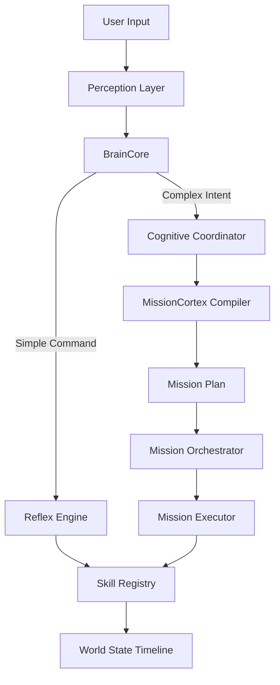
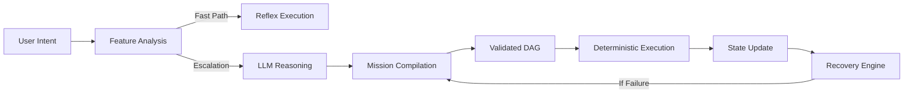

<!-- Typing Intro -->
<p align="center">
  
</p>

<h1 align="center">Alex Benny</h1>

<p align="center">
  <strong>B.Tech — Artificial Intelligence & Data Science</strong><br>
  <em>Deterministic AI Systems · Computer Vision · Full-Stack Engineering</em>
</p>

<p align="center">
  <a href="https://www.linkedin.com/in/alexx-benny/"></a>
  <a href="https://github.com/AlexxBenny"></a>
  <a href="mailto:alexbenny2004@gmail.com"></a>
  <a href="https://alexxbenny.github.io/"></a>
</p>

---

## ⚙️ What I Build

I build **deterministic AI systems** that execute tasks reliably — not just generate responses.

My focus:
- Turning LLM reasoning into **controlled execution pipelines**
- Designing systems that **plan -> validate -> act -> recover**
- Bridging **AI models with real-world actions**

---

## 🧠 MERLIN — Deterministic AI Execution System

> A production-grade, JARVIS-style desktop automation system built on **controlled autonomy, not agent chaos**

### Why MERLIN exists

Most AI agents:
- hallucinate actions
- lack execution control
- break in real-world environments

MERLIN solves this by enforcing:
- deterministic pipelines
- execution safety
- structured planning

### Core Architecture

Perception Layer
-> Cognitive Coordinator (LLM reasoning + memory context)
-> MissionCortex (plan compiler -> validated DAG)
-> MissionOrchestrator
-> Deterministic Executor (safe, auditable execution)

### Key Capabilities

- 🔒 **Deterministic execution gate** (no blind agent actions)
- 🧠 **ExecutionCoordinator** for structured reasoning
- 🧩 **Mission-based planning system (DAG compilation)**
- 🔁 **Outcome-aware recovery system** (soft vs hard failures)
- ⏱️ **Persistent scheduler** (tick-based execution loop)
- 📂 **Centralized PathResolver** (system-wide consistency)
- 🧠 **Memory-aware reasoning** (UserKnowledgeStore integration)

### What Makes It Different

- No uncontrolled agent loops
- No re-parsing for scheduled tasks
- Full auditability of execution
- Hybrid intelligence: **LLM reasoning + deterministic systems**

---

## 🏗️ System Design Principles

```python
principles = {
    "determinism": "Execution must be predictable and reproducible",
    "safety": "All actions pass through validation gates",
    "separation": "Reasoning ≠ execution",
    "auditability": "Every step is traceable",
    "recovery": "Failures trigger structured replanning, not chaos"
}
```

---

## 🚀 Selected Work

### 🧠 MERLIN — Deterministic Cognitive Agent System (Flagship)

> A determinism-first system that keeps **reasoning separate from execution** so the behavior stays predictable.

I wanted something that can take real actions without the usual “agent chaos” problem. So MERLIN does **plan first, validate, then execute**—and if something breaks, it classifies the failure and recovers intentionally instead of retrying blindly.

🔗 https://github.com/AlexxBenny/Merlin

---

### ⚡ Core Capabilities

- 🧠 **LLM → Compiler Model**: converts natural language into validated Mission DAGs (no direct action dumping)
- ⚙️ **Deterministic Execution Engine**: no hallucinated actions; everything runs through strict skill contracts
- 🔁 **Outcome-Aware Recovery**: failure classification + structured retries (soft vs hard)
- ⏱️ **Persistent Scheduler**: tick-based runtime that executes precompiled plans
- 🧠 **Semantic User Memory**: facts, preferences, and policies via `UserKnowledgeStore`
- 💻 **Deep OS Integration**: file system, apps, browser, and system controls
- 🌐 **Decoupled UI System**: React dashboard + PySide6 widget via an API bridge

---

### 🏗️ 4-Layer Cognitive Architecture

MERLIN keeps the pipeline intentionally separated—so behavior stays predictable:





---

### 🧠 Key System Innovations

1. **Deterministic > Agentic**: no uncontrolled loops; no direct LLM -> action mapping; every action passes through validation
2. **Compile-time Planning**: natural language -> structured DAG; validation happens before execution starts
3. **Reflex Fast-Path**: simple commands run without invoking the LLM; low latency for “small, safe” actions
4. **World-State Driven Intelligence**: append-only event timeline; context derived from actual system state
5. **Inline Recovery System**: failures are classified first; recovery actions are generated intentionally (not “try again and pray”)

---

### ⚙️ System Components (Real Breakdown)

- `BrainCore` -> routing authority (reflex vs reasoning)
- `MissionCortex` -> LLM-based plan compiler
- `MissionExecutor` -> deterministic DAG executor
- `TickSchedulerManager` -> persistent job execution
- `AttentionManager` -> notifications & interruption control
- `UserKnowledgeStore` -> structured memory system
- `PathResolver` -> global filesystem authority

---

📚 **Smart-Acad — AI Academic Platform**  
Multi-role platform with analytics, automation, and AI insights  
Role-based dashboards · AI-powered academic tracking · Real-time data visualization  
🔗 https://github.com/AlexxBenny/Smart_Acad

🏥 **CareHive — AI Healthcare Assistant**  
Built for Carestack x Carerevenue hackathon  
Patient management system · AI-assisted workflows · Healthcare automation features  
🔗 https://github.com/AlexxBenny/carehive

---

## 🧩 Capabilities

### AI Systems
- LLM orchestration & planning systems
- Multimodal pipelines (vision + language + action)
- Context-aware execution frameworks

### Computer Vision
- Object detection (YOLO)
- OCR systems (EasyOCR)
- Face recognition & emotion detection

### Engineering
- Backend systems (FastAPI, Flask)
- Full-stack apps (React + Node)
- CI/CD pipelines (GitHub Actions, Azure)

---

## 🏆 Achievements

- 🥇 1st Prize — Smart-Acad
- 🥇 1st Prize — Fluento (AI language learning system)
- 🥉 3rd Place — National Gen AI Hackathon (amFOSS)

---

## 🔬 Currently Exploring

- Edge AI deployment (TensorRT / ONNX Runtime)
- Autonomous system design (agent -> controller shift)
- Real-world AI execution reliability

---

## 📊 GitHub Stats

<p align="center">
  
  
</p>

## 🔥 Streak Stats

<p align="center">
  
</p>

## 📈 Contribution Graph

<p align="center">
  
</p>

---

## 🤝 Connect

<p align="center">
  <a href="https://www.linkedin.com/in/alexx-benny/"></a>
  <a href="mailto:alexbenny2004@gmail.com"></a>
</p>

<p align="center"><em>Building systems that don't just think — but execute.</em></p>
